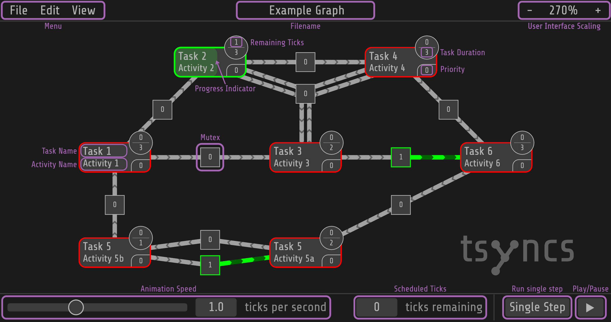

# Task Synchronisation Simulator
A simple tool to simulate the execution of interdependent tasks. Try it out at [tsyncs.de](https://tsyncs.de/).

## Tutorial
tsyncs provides a convenient way to load and visualise task graphs. At the top is the menu bar. Here you can import and export task charts, save and load your current session, and start a new session. You can also edit the diagram and change the view.



### File Menu
To load a task, select 'File -> Import Graph...' and select a CSV file containing the task graph. You can also export the current graph as a CSV file by choosing `File -> Export Graph...`.
You can also save the current session by selecting 'File -> Save Graph...' and load a saved session by selecting 'File -> Load Graph'.

To start a new empty session select 'File -> New Graph'.

### Editing the Graph
The task graph is displayed in the main window. You can zoom in and out using the mouse wheel and pan by dragging the mouse. You can also move the tasks by dragging them.

The tasks and mutexes are connected by arrows, which represent the dependencies between the tasks. The arrows are coloured according to where the tasks are flowing. A running task is highlighted by a green border, a waiting task by a red border.

You can change the duration of a task by changing the value in the top right corner of the task. Below this is the amount of time the task will remain active. You can change both values by clicking on them and typing in the new value, or by dragging your mouse or finger left and right. You can also change the priority of a task by clicking on the priority value in the bottom right corner and typing in the new value or dragging your mouse or finger left and right.

To change the value of a mutex, click in the middle of the mutex and type in the new value, or drag your mouse or finger left and right.

#### Adding Tasks and Mutexes
To add a new task, right click on an empty area of the canvas. This adds a new task. If you right click on a task, you can link it to existing mutexes by clicking on the mutex you want to link it to. Clicking on a task will create a mutex between the two tasks.

#### Deleting a Task or Mutex
To delete a task or mutex, click on 'Edit -> Delete mode' to activate the delete mode. Now you can click on a task or mutex to delete it.
To exit the delete mode, click on the warning that appears while the delete mode is active.

### Simulation Settings
At the bottom you will find the simulation settings. On the left you can change the speed of the simulation using the slider in the 'ticks per second' bottom left corner. The simulation speed is the number of ticks per second. One tick reduces the remaining time of the active task by one.

You can also pause the animation by clicking on the Pause ⏸ button. When the animation is paused, you can use the Single Step button to perform a single tick at a time. This button will schedule a new tick to run which can be seen and edited in the 'Ticks Remaining' file next to a text box with the remaining ticks. You can change the remaining ticks by clicking in the text box and typing in the new value or dragging your mouse or finger left and right. You can also perform a single step by clicking on the 'Single Step' button. You can continue the automatic simulation by clicking Play ▶️.

### File Format
You can import and export your task as a CSV file.
There are two types for entries in the CSV file `Task` and `Mutex`.
Task entries take the following format:
```csv
Task; Position X; Position Y; ID; Task-Name; Activity-Name; Priority; Duration; Remaining Duration; [Semicolon seperated list of Connected Mutex IDs]
```

Mutex entries take the following format:
```csv
Mutex; Position X; Position Y; ID; Mutex Value; [Semicolon seperated list of Connected Task IDs]
```

#### Example CSV file
```csv
Type;Position X;Position Y;ID;Parameters...
#Task;Position X;Position Y;ID;Task Name;Activity Name;Priority;Duration;Remaining Duration;[Semicolon seperated list of Connected Mutex IDs]
Task;300;100;0;Task 2;Activity 2;0;3;0;0;2
Task;150;250;1;Task 1;Activity 1;0;3;0;1;4
Task;150;400;2;Task 5;Activity 5b;0;1;0;7;8
Task;450;400;3;Task 5;Activity 5a;0;2;0;9
Task;450;250;4;Task 3;Activity 3;0;2;0;2;5
Task;600;100;5;Task 4;Activity 4;0;3;0;2;3
Task;750;250;6;Task 6;Activity 6;0;3;0;6
#Mutex;Position X;Position Y;ID;Mutex Value;[Semicolon seperated list of Connected Task IDs]
Mutex;225;175;1;0;0
Mutex;300;380;9;0;2
Mutex;150;325;7;0;1
Mutex;300;250;4;0;4
Mutex;600;325;6;0;3
Mutex;450;100;0;0;5
Mutex;450;150;2;1;4;5;0
Mutex;300;420;8;1;3
Mutex;600;250;5;0;6
Mutex;675;175;3;0;6
```
