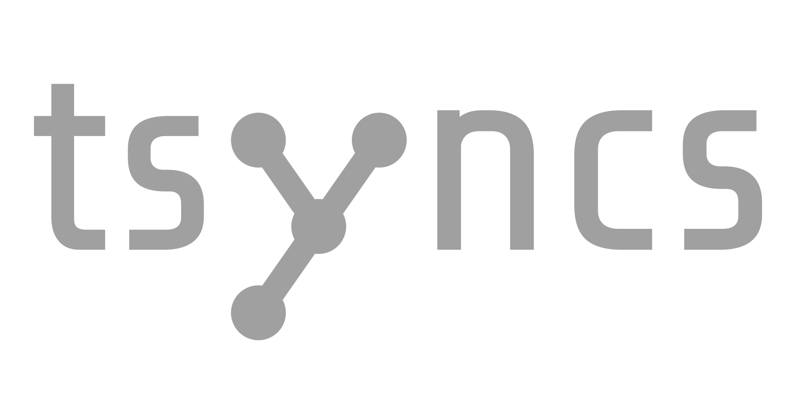

# Task Synchronization Simulator
A simple tool to simulate the execution of interdependent tasks.
Try it out at [tsyncs.de](https://tsyncs.de/).

## Tutorial
tsyncs provides a convenient way to load and visualize task graphs.
At the top is the menu bar.
Here you can import and export task charts, save and load your current session, and start a new session.
You can also edit the diagram and change the view.


### File Menu
To load a graph, select `File -> Import Graph...` and select a CSV file containing the task graph.
You can also export the current graph as a CSV file by choosing `File -> Export Graph...`.
You can also save the current session by selecting `File -> Save Graph...` and load a saved session by selecting `File -> Load Graph`.

To start a new empty session select `File -> New Graph`.

### Editing the Graph
The task graph is displayed in the center of the screen.
You can zoom in and out using `CTRL` `mouse wheel` and pan by dragging the mouse.
You can move nodes by dragging them.

The tasks and mutexes are connected by arrows, which represent the dependencies between the tasks.
A running task is highlighted by a green border, a waiting task by a red border.

The circle in the top right corner of a task shows the remaining duration above the full duration of the task.
The task priority is shown in the bottom right corner.

Mutexes simply show their current count.

All these values can be edited by dragging, or by clicking on them.

#### Adding Tasks and Mutexes
You can add a new task by right clicking on an empty area of the canvas.
Using right click, you can connect existing nodes, or create new nodes that are immediately connected.
Connections can be deleted the same way they are created.

#### Deleting a Task or Mutex
To delete a task or mutex, click on `Edit -> Delete mode` to activate the delete mode.
Now you can click on any node to delete it.
Exist delete mode using right click, or by clicking the warning at the top of the screen.

### Simulation Settings
At the bottom you will find the simulation settings.

The slider on the left changes the simulation speed, and on the very right is a pause button ⏸.
When the simulation is paused, you can use the `Single Step` button to manually advance the simulation by one tick.
This button will schedule a new tick, which will then be executed at the configured simulation speed.
You can see and edited the amount of scheduled ticks left of the `Single Step` button.

### File Format
You can export and import graphs to and from CSV files.
There are two types of entries in the CSV file `Task` and `Mutex`.
Task entries take the following format:
```csv
Task; Position X; Position Y; ID; Task-Name; Activity-Name; Priority; Duration; Remaining Duration; [Semicolon seperated list of Connected Mutex IDs]
```

Mutex entries take the following format:
```csv
Mutex; Position X; Position Y; ID; Mutex Value; [Semicolon seperated list of Connected Task IDs]
```

#### Example CSV file
```csv
Type;Position X;Position Y;ID;Parameters...
#Task;Position X;Position Y;ID;Task Name;Activity Name;Priority;Duration;Remaining Duration;[Semicolon seperated list of Connected Mutex IDs]
Task;300;100;0;Task 2;Activity 2;0;3;0;0;2
Task;150;250;1;Task 1;Activity 1;0;3;0;1;4
Task;150;400;2;Task 5;Activity 5b;0;1;0;7;8
Task;450;400;3;Task 5;Activity 5a;0;2;0;9
Task;450;250;4;Task 3;Activity 3;0;2;0;2;5
Task;600;100;5;Task 4;Activity 4;0;3;0;2;3
Task;750;250;6;Task 6;Activity 6;0;3;0;6
#Mutex;Position X;Position Y;ID;Mutex Value;[Semicolon seperated list of Connected Task IDs]
Mutex;225;175;1;0;0
Mutex;300;380;9;0;2
Mutex;150;325;7;0;1
Mutex;300;250;4;0;4
Mutex;600;325;6;0;3
Mutex;450;100;0;0;5
Mutex;450;150;2;1;4;5;0
Mutex;300;420;8;1;3
Mutex;600;250;5;0;6
Mutex;675;175;3;0;6
```
## Building the Project
To build the project, you need to have rust installed.
You can install rust by following the instructions on the [official rust website](https://rustup.rs/).

### Native Build
```pwsh
cargo run --release
```
This will build the project and start the application.

### Web Assembly Build
To run the project for the web, you need to have `trunk` installed.
You can install trunk by running the following command:
```pwsh
cargo install trunk
```

Then start a local webserver using:
```pwsh
trunk serve --release
```
Once the build is complete, you can open the URL shown by trunk in your browser.
If you see only a blank or gray screen, try force-reloading the page.
This can be done by pressing `CTRL` `F5` in most browsers.
